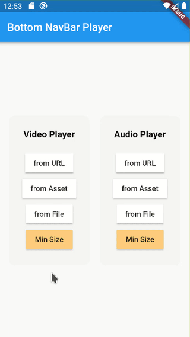

## Bottom NavBar Player
A Flutter plugin to play media in BottomNavigationBar and bottomSheet with `file`, `web` and `asset` playback capabilities.
Simply play sounds in different input methods in the list or anywhere else.



### Getting Started
In order to use this package, do import
```dart
import 'package:bottom_navbar_player/bottom_navbar_player.dart';
```
First, create an instance of the class:
```dart
final bottomNavBarPlayer = BottomNavBarPlayer();
```

Set the player widget for `BottomNavigationBar` or `bottomSheet` scaffold:
```dart
Scaffold(
        bottomSheet: bottomNavBarPlayer.view(),
      ),
```   

To play the sound from the `URL`, proceed as follows:
```dart
MaterialButton(
              onPressed: () => bottomNavBarPlayer.play(
                  'https://download.samplelib.com/mp3/sample-9s.mp3',
                  sourceType: SourceType.url),
              child: const Text('play from URL'),
            )
```

To play the sound from the `Asset`, proceed as follows:
```dart
MaterialButton(
              onPressed: () => bottomNavBarPlayer.play('assets/audio.mp3',
                  sourceType: SourceType.asset),
              child: const Text('play from Asset'),
            )
```

To play the sound from the `File`, proceed as follows:
```dart
MaterialButton(
              onPressed: () => bottomNavBarPlayer.play(
                  '/storage/sdcard/Download/audio_file.mp3',
                  sourceType: SourceType.file),
              child: const Text('play from File'),
            )
```


### Permissions

If you use an internet URL:
```xml
<uses-permission android:name="android.permission.INTERNET"/>
```

If you use the File:
```xml
    <uses-permission android:name="android.permission.READ_INTERNAL_STORAGE"/>
    <!-- or -->
    <uses-permission android:name="android.permission.READ_EXTERNAL_STORAGE"/>
```


### License
MIT

### About
Built with <3   
by Mostafa Efafi  
